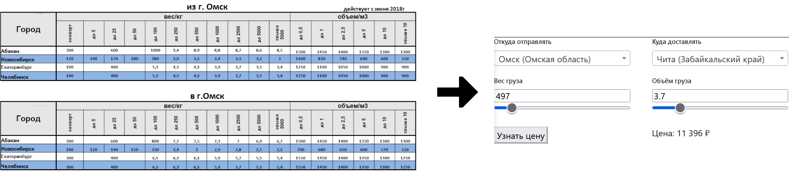

# RozaVetrov TarifEditor

## Описание

Инструмент для автоматизации расчета стоимости междугородних грузоперевозок. Клиентам и сотрудникам значительно проще узнавать стоимость онлайн, вместо использования многоколоночных тарифных таблиц.



## Установка и запуск

### Структура каталогов
```md
.
├── RozaVetrov_TarifEditor  # Редактор тарифов C#-приложение
└── docker-services
    ├── database            # База данных и файлы для инициализации
    ├── frontend            # Веб-калькулятор
    └── docker-compose.yml  # nginx с веб-калькулятором, rest api, postgresql
```

### Установка и запуск
```bash
# Docker-контейнеры
cd docker-services
docker-compose up -d
```
```bash
# C#-приложение
cd RozaVetrov_TarifEditor
dotnet run
```

## Как это работает

### 1. **Веб-калькулятор**
Веб-виджет позволяет конечным пользователям легко рассчитать стоимость грузоперевозки между выбранными городами.
- **Технологии**: HTML, CSS, JavaScript (jQuery, Select2).
- **Как работает**:
  - Пользователь выбирает города отправления и назначения, вводит вес и объем груза.
  - Веб-виджет отправляет запрос к REST API для получения данных о стоимости перевозки.
  - REST API обрабатывает запрос и возвращает рассчитанную стоимость.


### 2. **REST API (PostgREST)**
PostgREST автоматически создает REST API на основе базы данных PostgreSQL.
- **Как работает**:
  - Принимает запросы от веб-виджета.
  - Вызывает функции в базе данных для расчета стоимости грузоперевозки.
  - Возвращает результат в формате JSON.


### 3. **База данных (PostgreSQL)**
Хранит данные о городах, коэффициентах перевозки, тарифах, функции расчёта (PL/pgSQL), триггеры для ведения истории изменений данных.
- **Функции**:
  - `calculate_price(fromcity_id, incity_id, weight, size)`: Рассчитывает стоимость перевозки между городами с учетом веса и объема груза.
  - `get_transportation_id(fromcity_id, incity_id)`: Возвращает идентификатор перевозки между городами.
- **Как работает**:
  - Функции вычисляют стоимость на основе данных, хранящихся в таблицах базы данных.
  - Результаты вычислений возвращаются через REST API.


### 4. **Десктопное приложение (TarifEditor)**
Приложение на C# для управления данными в базе данных.
- **Технологии**: C#, .NET Core, Entity Framework, WPF, Material Design In XAML.
- **Как работает**:
  - Подключается к БД по учётным данным из таблицы `user`.
  - Позволяет добавлять, изменять и удалять данные о городах, коэффициентах и тарифах.


### 5. **Docker и Docker Compose**
Контейнеризация и развертывание всех компонентов проекта.
- **Как работает**:
  - `docker-compose.yml`: Конфигурационный файл для запуска всех необходимых сервисов (nginx, PostgREST, PostgreSQL).
  - Упрощает развертывание и управление проектом.


